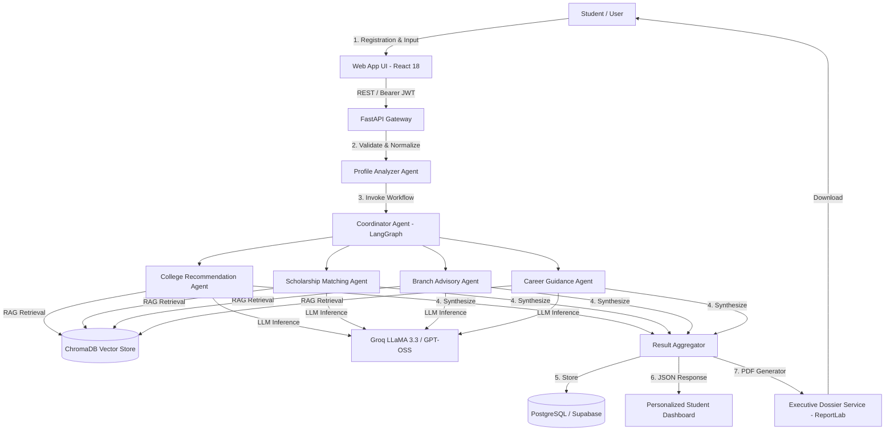

# EduGuide AI 2.0 — Autonomous Admission Navigator & Career Advisory

<div align="center">


[](LICENSE)
[](https://react.dev/)
[](https://www.typescriptlang.org/)
[](https://tailwindcss.com/)
[](https://fastapi.tiangolo.com)
[](https://langchain-ai.github.io/langgraph/)
[](https://www.trychroma.com/)
[](https://groq.com/)

**An autonomous multi-agent admission counseling and career guidance ecosystem.**  
Synthesizes candidate exam ranks, historical cutoff archives across 1,200+ universities, state & central scholarship schemes, and industry hiring trends into actionable academic strategies and executive-grade counseling dossiers.

[Live Web App](https://eduguide-indol.vercel.app) • [API Endpoint](https://eduguide.fastapicloud.dev) • [Interactive API Docs (Swagger)](https://eduguide.fastapicloud.dev/docs)

</div>

---

## 🌟 Key Features

### 🤖 Autonomous Multi-Agent Counseling Engine (16 Components)
- **Profile Analyzer Agent**: Ingests, normalizes, and validates student scores (ranks, marks %, quota category, budget, and location).
- **Coordinator Agent (LangGraph StateGraph)**: Orchestrates specialized agents in a deterministic DAG workflow with state checkpointing.
- **College Recommendation Agent**: Forecasts admission probabilities across Tier-1, Tier-2, and Tier-3 institutions based on round-by-round historical cutoffs.
- **Scholarship Agent**: Matches eligible state fee reimbursements, merit endowments, and private scholarship programs.
- **Branch Recommendation Agent**: Evaluates curricular aptitude and calculates alignment fit scores across engineering and technology majors.
- **Career Guidance Agent**: Synthesizes a structured 4-year progression roadmap, recommended industry certifications, and post-graduation pathways (Placements, MS abroad, GATE).
- **Result Aggregator**: Combines agent outputs into unified strategy briefs with rationale explanations.
- **RAG Chatbot Agent**: Grounded interactive Q&A assistant backed by ChromaDB vector storage and semantic search.

### 🔐 Modern Security & Pure OAuth 2.0
- **Google Identity Services (OAuth 2.0)**: Direct client-side token flow (`gsi/client`) without insecure workarounds or test bypasses.
- **Real SMTP Email Verification**: Real-time polling activation (`check-verification`) and expiring token verification links.
- **JWT Bearer Authentication**: Secure session handling with bcrypt password hashing.

### 🎯 Multi-Path Onboarding & Global Readiness
- **Dual Destination Mode**:
  - 🇮🇳 **Indian Entrance Mode**: EAPCET (Telangana / Andhra Pradesh), JEE Main, JEE Advanced, NEET, KCET, BITSAT.
  - 🌏 **Study Abroad Mode**: SAT, ACT, GRE, IELTS, TOEFL with international budget conversions ($ USD vs ₹ INR).
- **Smart Form UX**: Step-by-step wizard with category quota selectors, dynamic currency formatting, and quick-fill branch chips.

### 📄 Executive-Grade Counseling Dossier (PDF Report)
- Built with ReportLab using a two-pass **`NumberedCanvas`** for running headers and dynamic `"Page X of Y"` footers.
- **4-Card Executive KPI Scorecard**: Entrance Rank, Matched Colleges, Financial Aid Potential, Top Branch Fit.
- **Color-Coded Probability Badges**: Safe (≥80%), Target (50–79%), Ambitious (<50%).
- **Markdown-to-Flowable Engine**: Intelligently renders LLM markdown tables as native ReportLab tables with dark-mode headers and zebra striping.
- **Authentic Verification Seal**: Cryptographic security token and portal authentication badge.

---

## 🏗️ Architecture & Component Code Map



| # | System Component | Backend Location | Responsibility |
|---|---|---|---|
| **1** | Student Input & Auth | `app/routers/auth.py`, `student_profile.py` | Registration, login, Google OAuth, profile ingestion |
| **2** | Profile Analyzer | `app/agents/profile_analyzer.py` | Data normalization, quota resolution, anomaly checks |
| **3** | Coordinator Agent | `app/agents/coordinator_agent.py` | LangGraph StateGraph pipeline orchestration |
| **4** | RAG Pipeline | `app/rag/pipeline.py` | Context retrieval, semantic similarity ranking |
| **5** | LLM Engine | `app/rag/llm_client.py` | Groq LLaMA client (with OpenAI / local Ollama fallback) |
| **6** | College Agent | `app/agents/college_agent.py` | Cutoff comparisons, tier placement, probability scoring |
| **7** | Scholarship Agent | `app/agents/scholarship_agent.py` | Government & institutional financial aid matching |
| **8** | Branch Agent | `app/agents/branch_agent.py` | Curricular fit calculation & starting salary predictions |
| **9** | Career Agent | `app/agents/career_agent.py` | 4-year semester roadmaps & certification milestones |
| **10** | Chatbot Agent | `app/agents/chatbot_agent.py` | RAG-grounded admission advisory conversational bot |
| **11** | Knowledge Base | `app/routers/knowledge_base.py` | Ingestion, chunking, and document indexing |
| **12** | Vector Database | `app/rag/vector_store.py` | ChromaDB collection storage & embeddings |
| **13** | Result Aggregator | `app/agents/result_aggregator.py` | Structured synthesis & counseling rationale |
| **14** | Student Dashboard | `app/routers/dashboard.py` | Profile summary, tiered recommendations, charts |
| **15** | PDF Report Generator | `app/services/pdf_report.py` | Official executive-grade counseling dossier export |
| **16** | Notifications & Alerts | `app/services/notifications.py` | Deadline alerts, verification reminders |

---

## 💻 Tech Stack

### Frontend
- **Framework**: React 18, Vite 8
- **Language**: TypeScript 5
- **Styling**: Tailwind CSS v4, Lucide React Icons
- **Routing**: React Router v7
- **Data Management**: TanStack Query (React Query), Axios with auth interceptors
- **Forms**: React Hook Form, Zod Schema Validation
- **Charts**: Recharts

### Backend
- **Framework**: FastAPI (Python 3.11)
- **Agent Orchestration**: LangGraph, LangChain Core
- **LLM Inference**: Groq Cloud API (`openai/gpt-oss-120b`, `llama-3.3-70b-versatile`)
- **Vector Store**: ChromaDB with local ONNX embeddings
- **Database / ORM**: PostgreSQL (Supabase Pooler), SQLAlchemy 2.0
- **Document Generation**: ReportLab 5.0, PyMuPDF (fitz)
- **Email Delivery**: Python `smtplib` (Gmail App Passwords / Custom SMTP)

---

## 🚀 Quick Start (Local Development)

### 1. Frontend Setup

```bash
# From repository root
npm install

# Configure environment variables
cp .env.example .env
```

Edit `.env`:
```env
VITE_API_BASE_URL=http://localhost:8000/api/v1
VITE_GOOGLE_CLIENT_ID=your-google-oauth-client-id.apps.googleusercontent.com
```

Start the Vite development server:
```bash
npm run dev
```
Open `http://localhost:5173` in your browser.

---

### 2. Backend Setup

```bash
# In the parent backend repository
python -m venv .venv
.\.venv\Scripts\activate
pip install -r requirements.txt
cp .env.example .env

# Populate sample data and knowledge base
python generate_structured_data.py
python generate_knowledge_base.py

# Start FastAPI server
uvicorn app.main:app --reload --port 8000
```

---

## 🌐 Production Deployment

### Frontend (Vercel)
The project is configured for single-page application routing via `vercel.json`:
1. Link the repository to [Vercel](https://vercel.com).
2. Set the environment variables in the Vercel Dashboard:
   - `VITE_API_BASE_URL=https://eduguide.fastapicloud.dev/api/v1`
   - `VITE_GOOGLE_CLIENT_ID=your_client_id.apps.googleusercontent.com`
3. Deploy directly via `git push origin main`.

### Backend (FastAPI Cloud)
```bash
fastapi cloud login
fastapi cloud deploy
```

---

## 🛡️ Google OAuth 2.0 Configuration

1. In the [Google Cloud Console](https://console.cloud.google.com/apis/credentials), create an **OAuth 2.0 Client ID** (Web application).
2. Add **Authorized JavaScript origins**:
   - `http://localhost:5173`
   - `https://eduguide-indol.vercel.app`
3. Set `VITE_GOOGLE_CLIENT_ID` in your environment.

---

## 📄 License

This project is licensed under the [MIT License](LICENSE).

